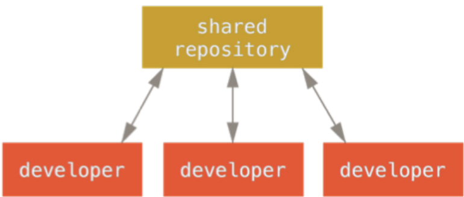
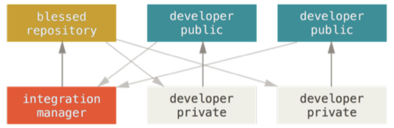
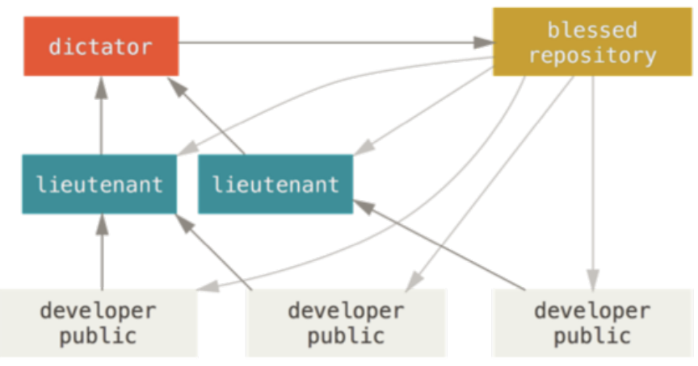

# COMP4111 Final
## Configuration Management
1. __Main reasons for doing Configuration Management__
    - ___Professor Key Point:___ A recorder to record what you are doing.
    - __Slide:__ Manages evolving Software System & controls the cost involved making changes to a system.
2. __Basic Concepts: version, baseline, promotion, release, revision__
    - __Version:__
      - The initial release or re-release of a configuration item associated with a complete compilation or recompilation of the item. Different versions have different functionality.
    - __Baseline:__
      - A specification or product that has been formally reviewed and agreed to by responsible management, that thereafter serves as the basis for further development, and can be changed only through formal change control procedures.
      - __Promotion (check-out/check-ins):__
      - The internal development state of a software is changed
    - __Release:__
      - The formal distribution of an approved version to users.
      - A changed software system is made visible outside the development organization.
      - __Revision:__
      - Changes to controlled artifacts, which could lead to a new version or new release.
3. __Differences between CVS/Subversion and Git___
    - __CVS__
      - Based on __RCS__, allows  concurrency without unlocking.
      - __Subversion__
      - Based on __CVS__
        - Subversion interface and features similar to CVS
        - Commands: checkout, add, delete, commit, diff
      - __Differences__
        - Version controlled moving, renaming, copying of files and directories.
        - Version controlled metadata of files and directories.
      - Server Options
        - Standalone installation
        - Integrated into the Apache web server
        - The time took by branch management is independent of the size of the system (__CVS creates physical copies__ of the files, __Subversion uses only tags/links__)
    - __Git__
      -	Decentralized Configuration Management
        - No centralized repository
        - No global version numbering/each item has a unique hash code
        - No duplication files for branches, since everyone has its own repository
        - Check in/out against local copies.
  4. __Four forms (ways) of CM using Git__
    - __Centralized Workflow__
        - Conventional workflow as in SVN or CVS

        
        - Developer clones the entire repository
          - Create local branches
          - Push changes to the shared repository
          - Detect conflicts at the shared repository
    - __Integration Manager__
        - Typical workflow in GitHub or BitBucket
        - Relies on a central repository to provide access control

        
        - The central server maintains the (blessed) reference repository.
        - The reference repository has an "owner" and a few administrators.
        - Developers first "fork" the reference repository on the server, then clone the "forked" repository then send a "pull request" through the central sever.
        - The integration manager (owner) pull the changes from the "fork" repository to the reference repository.
    - __Dictator and Lieutenant__
        - Workflow for large software system such as Linux Kernel.
          - Hundreds of Developers
          - Dozens of subsystems

        
          - Essentially an integrated workflow for many Integration Manager workflows
          - Each lieutenant is the Integration manager of a subsystem who
            - Clones the reference repository.
            - Pulls changes from developer's repository to his or her repository.
          - Dictator pulls changes from lieutenant's repository and push to the reference repository.

## RPC
1. __What's Remote Procedure Call (RPC)?
    - ___Professor's key concept:___ Communication remotely like local functional call.
    - __Wikipedia:__ RPC is when a computer program causes a procedure (subroutine) to execute in a different address space (commonly on another computer or on a shared network), which is coded as if it were a normal (local) procedure call, without the programmer explicitly coding the details for the remote interaction.
2. __What's synchronous/Asynchronous RPC?__
    - __Synchronous:__ process needs to wait (block)
      - Caller blocks until a response is returned or an exception is raised.
    - __Asynchronous:__ Come back to query the result in the future.
        - Caller continues immediately and can later block until response is delivered.
3. What's good/bad about RPC compared to Restful?
    - ___Professor's Key point:___ table in the slide (in terms of ease, efficiency and scalability) __no winner__.

    Markdown | Less | Pretty
    --- | --- | ---
    *Still* | `renders` | **nicely**
    1 | 2 | 3

    
