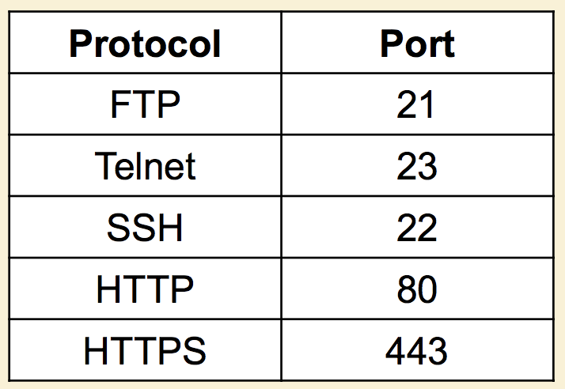

# COMP4111 Final
## Configuration Management
1. __Main reasons for doing Configuration Management__
    - ___Professor Key Point:___ A recorder to record what you are doing.
    - __Slide:__ Manages evolving Software System & controls the cost involved making changes to a system.
2. __Basic Concepts: version, baseline, promotion, release, revision__
    - __Version:__
      - The initial release or re-release of a configuration item associated with a complete compilation or recompilation of the item. Different versions have different functionality.
    - __Baseline:__
      - A specification or product that has been formally reviewed and agreed to by responsible management, that thereafter serves as the basis for further development, and can be changed only through formal change control procedures.
      - __Promotion (check-out/check-ins):__
      - The internal development state of a software is changed
    - __Release:__
      - The formal distribution of an approved version to users.
      - A changed software system is made visible outside the development organization.
      - __Revision:__
      - Changes to controlled artifacts, which could lead to a new version or new release.
3. __Differences between CVS/Subversion and Git___
    - __CVS__
      - Based on __RCS__, allows  concurrency without unlocking.
      - __Subversion__
      - Based on __CVS__
        - Subversion interface and features similar to CVS
        - Commands: checkout, add, delete, commit, diff
      - __Differences__
        - Version controlled moving, renaming, copying of files and directories.
        - Version controlled metadata of files and directories.
      - Server Options
        - Standalone installation
        - Integrated into the Apache web server
        - The time took by branch management is independent of the size of the system (__CVS creates physical copies__ of the files, __Subversion uses only tags/links__)
    - __Git__
      -	Decentralized Configuration Management
        - No centralized repository
        - No global version numbering/each item has a unique hash code
        - No duplication files for branches, since everyone has its own repository
        - Check in/out against local copies.
  4. __Four forms (ways) of CM using Git__
    - __Centralized Workflow__
        - Conventional workflow as in SVN or CVS

        
        - Developer clones the entire repository
          - Create local branches
          - Push changes to the shared repository
          - Detect conflicts at the shared repository
    - __Integration Manager__
        - Typical workflow in GitHub or BitBucket
        - Relies on a central repository to provide access control

        
        - The central server maintains the (blessed) reference repository.
        - The reference repository has an "owner" and a few administrators.
        - Developers first "fork" the reference repository on the server, then clone the "forked" repository then send a "pull request" through the central sever.
        - The integration manager (owner) pull the changes from the "fork" repository to the reference repository.
    - __Dictator and Lieutenant__
        - Workflow for large software system such as Linux Kernel.
          - Hundreds of Developers
          - Dozens of subsystems

        
          - Essentially an integrated workflow for many Integration Manager workflows
          - Each lieutenant is the Integration manager of a subsystem who
            - Clones the reference repository.
            - Pulls changes from developer's repository to his or her repository.
          - Dictator pulls changes from lieutenant's repository and push to the reference repository.

## RPC
1. __What's Remote Procedure Call (RPC)?__
    - ___Professor's key concept:___ Communication remotely like local functional call.
    - __Wikipedia:__ RPC is when a computer program causes a procedure (subroutine) to execute in a different address space (commonly on another computer or on a shared network), which is coded as if it were a normal (local) procedure call, without the programmer explicitly coding the details for the remote interaction.
2. __What's synchronous/Asynchronous RPC?__
    - __Synchronous:__ process needs to wait (block)
      - Caller blocks until a response is returned or an exception is raised.
    - __Asynchronous:__ Come back to query the result in the future.
        - Caller continues immediately and can later block until response is delivered.
3. What's good/bad about RPC compared to Restful?
    - ___Professor's Key point:___ table in the slide (in terms of ease, efficiency and scalability) __no winner__.

      Factors | RPC | REST
      --- | --- | ---
      Easy to learn?| Learning native, no learning curve | language independent speaks HTTP
      Easy to use?| Deploy specialized middleware substrate | Deploy plugins to web servers
      Easy to change?| Recompile server/client code | Change of URL strings
      Easy to scale?|More users = more states to track on server | Client maintain states, server stores data
      Resilient to Error?| Need to handle class error| TCP/IP level reliability
    - Additional Info (__Comparison__)
        - Both are mainstream interfaces for distributed computing
        - Philosophically Different
          - In RPC, especially distributed objects, server maintains computational states.
          - In REST, client maintains computational states.
        - Example: Update last name of a user in our calendar system.
          - REST: two operation
            - HTTP GET: identify URL for the user
            - HTTP POST: update resource, client supplies all the information.
          - RPC: one operation
            - Invoke operation on the user object, server maps object to ID.
  4. __What's stub/Skeleton__
      - ___Professor's key concept:___
        - __Stub:__ adapter that translate a function call into a remote message.
        - __Skeleton__: adapter that translate a remote message to a function call.

## Encoding
> Note: for question 1 & 2, the good of XML is the bad for IIOP and vice versa

1. __What's good and bad about XML?__
    - __Good__
      - Truly Portable data
      - Easily readable by human users
      - Very expressive (semantics near data)
      - Very flexible and customizable (no finite tag set)
      - Easy to use from programs (libraries available)
      - Easy to convert into other representations (XML transformation Languages)
      - Many additional standards and tools
      - Widely used and supported.
2. __What's good and bad about IIOP?__
    - __Good__
      - Communication transparency
      - scalability
      - Code reusability
3. __Can you write a simple JSON definition for a Java class?__

## RESTful
1. __Basic definition__
    - REST= REpresentation State Transfer
      - To describe a design pattern for implementing networked systems.
      - Intended to evoke an image of how a well-designed Web application behaves: a network of web pages (a virtual state-machine), where the user progresses through an application by selecting links (State transitions), resulting in the next page (representing the next state of the application) by transferred to the user and rendered for their use.
2. __Pros and Cons of using RESTful design when implementing the same functionality__
    - __Pros__
      -  Do not identify a physical object. The advantage of using a
logical identifier (URL) is that changes to the underlying
implementation of the resource will be transparent to clients.
    - __Cons__
      - Loose coupling
3.  __Basic structure of the HTTP Protocol__
    - Browsers use the HTTP protocol to talk to
web servers
    - All they need is just an URL which
includes the hostname and the path of the
resource that you are looking for

    
    - To get to a Web page
      - Enter URL into the browser.
      - Browser connects to servers
      - browser sends an HTTP request to the servers
      - Server returns HTTP response.
      - Browser parses the requested resource and then make additional request for resources.

    
    - __Connecting the server__
        - The HTTP protocol isa simple client and server process.
        - The browser connects to the server typically through port 80
        -  Some of the other common ports are listed bellow

    
    - __Sending an HTTP Request__
      - Upon successfully connecting to the server, the browser sends an HTTP request in the following form:

    
    - This command asks for the root (/) resource from the server
    - This is the minimal HTTP request so that you can optionally add more ‘headers

    
    - __Returning an HTTP response__
      - Once the server gets the request, it will initiate an appropriate response.
        - ```200 OK```
        - ```201 Created```
        - ```400 Bad Request```
        - ```404 Not Found```
        - ```409 Conflict```
        - ```500 Internal Server Error```
4. __Why Cookie is important for HTTP/RESTful?__
    - ___Professor's Key point:___ Server side does not keep any state of client. But server needs. Use cookies as a token of who you are. Break what it means to be REST.

## Web Service
> A Web Service is a URL-addressable software resource that performs functions (or a function)
>

1. __Basic Components of a Web Service__
    - __Fire Wall__: These components decided what HTTP messages get out, and what get in.
      - These components enforce __Web security__.
    - __Routers__: These components decide where to send HTTP messages.
      -	These components manage __Web scaling__.
    - __Caches__: These components decided if a saved copy can be used.
      -	These components increase __Web speed__.
  > All these components base their decisions and actions purely upon information in the HTTP header.

  __Web Service Architecture__

  

  __Web Service Stack__

  
  - Set of standards for implementing web Service

  __Basic Web Service Usage Scenario__

  
  
2. __What's SOAP(Simple Object Access Protocol)?__
    - Light weight messaging framework based on XML.
    - Supports simple messaging and RPC.
    - SOAP consists of
      - Envelope construct: defines the overall structure of messages
      - Encoding rules: define the serialization of application data type.
      - SOAP RPC: defines representation of remote procedure calls a response.
      - Binding framework: binding to protocols such as HTTP, SMTP
      - Fault handling
    - SOAP supports advanced messaging processing:
      - __forwarding intermediaries__: route messages based on semantics of messages
      - __active intermediaries__: do additional processing before forwarding messages, may modify message    
  __SOAP Message__
    - Soap Message consists of
3. __What's WSDL?(Web Service Description Language)__
4. __What's UDDI? (Universal Description Discovery and Integration)__
