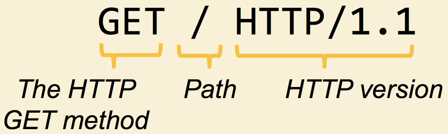
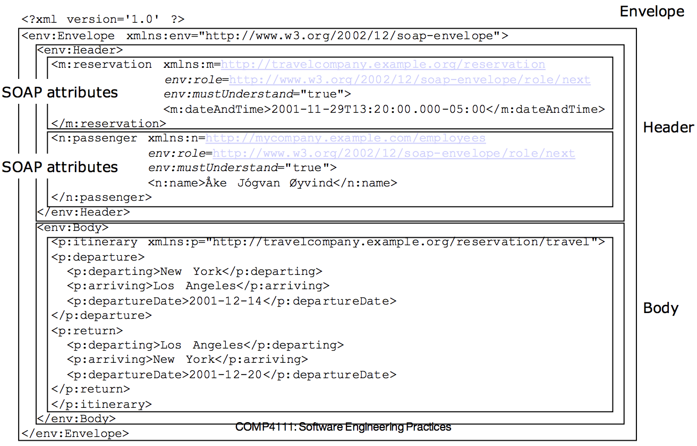
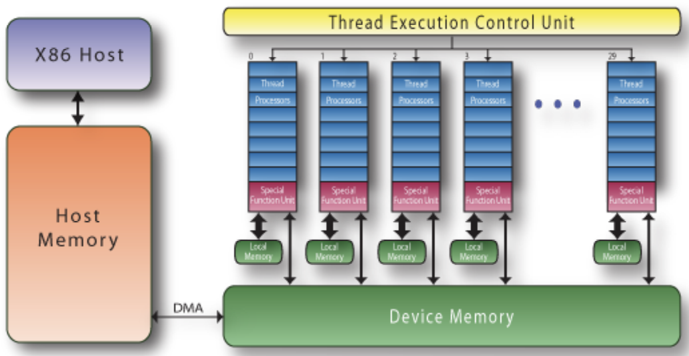

## Configuration Management
1. __Main reasons for doing Configuration Management__
    - ___Professor Key Point:___ A recorder to record what you are doing.
    - __Slide:__ Manages evolving Software System & controls the cost involved making changes to a system.
2. __Basic Concepts: version, baseline, promotion, release, revision__
    - __Version:__
      - The initial release or re-release of a configuration item associated with a complete compilation or recompilation of the item. Different versions have different functionality.
    - __Baseline:__
      - A specification or product that has been formally reviewed and agreed to by responsible management, that thereafter serves as the basis for further development, and can be changed only through formal change control procedures.
    - __Promotion (check-out/check-ins):__
      - The internal development state of a software is changed
    - __Release:__
      - The formal distribution of an approved version to users.
      - A changed software system is made visible outside the development organization.
    - __Revision:__
      - Changes to controlled artifacts, which could lead to a new version or new release.
3. __Differences between CVS/Subversion and Git___
    - __CVS__
      - Based on __RCS__, allows  concurrency without unlocking.
      - __Subversion__
      - Based on __CVS__
    - Subversion interface and features similar to CVS
        - Commands: checkout, add, delete, commit, diff
      - __Differences__
        - Version controlled moving, renaming, copying of files and directories.
        - Version controlled metadata of files and directories.
      - Server Options
        - Standalone installation
        - Integrated into the Apache web server
        - The time took by branch management is independent of the size of the system (__CVS creates physical copies__ of the files, __Subversion uses only tags/links__)
    - __Git__
      -	Decentralized Configuration Management
        - No centralized repository
        - No global version numbering/each item has a unique hash code
        - No duplication files for branches, since everyone has its own repository
        - Check in/out against local copies.
  4. __Four forms (ways) of CM using Git__
    - __Centralized Workflow__
        - Conventional workflow as in SVN or CVS

        
        - Developer clones the entire repository
          - Create local branches
          - Push changes to the shared repository
          - Detect conflicts at the shared repository
    - __Integration Manager__
        - Typical workflow in GitHub or BitBucket
        - Relies on a central repository to provide access control

        
        - The central server maintains the (blessed) reference repository.
        - The reference repository has an "owner" and a few administrators.
        - Developers first "fork" the reference repository on the server, then clone the "forked" repository then send a "pull request" through the central sever.
        - The integration manager (owner) pull the changes from the "fork" repository to the reference repository.
    - __Dictator and Lieutenant__
        - Workflow for large software system such as Linux Kernel.
          - Hundreds of Developers
          - Dozens of subsystems

        
          - Essentially an integrated workflow for many Integration Manager workflows
          - Each lieutenant is the Integration manager of a subsystem who
            - Clones the reference repository.
            - Pulls changes from developer's repository to his or her repository.
          - Dictator pulls changes from lieutenant's repository and push to the reference repository.

## RPC
1. __What's Remote Procedure Call (RPC)?__
    - ___Professor's key concept:___ Communication remotely like local functional call.
    - __Wikipedia:__ RPC is when a computer program causes a procedure (subroutine) to execute in a different address space (commonly on another computer or on a shared network), which is coded as if it were a normal (local) procedure call, without the programmer explicitly coding the details for the remote interaction.
2. __What's synchronous/Asynchronous RPC?__
    - __Synchronous:__ process needs to wait (block)
      - Caller blocks until a response is returned or an exception is raised.
    - __Asynchronous:__ Come back to query the result in the future.
        - Caller continues immediately and can later block until response is delivered.
3. What's good/bad about RPC compared to Restful?
    - ___Professor's Key point:___ table in the slide (in terms of ease, efficiency and scalability) __no winner__.

      Factors | RPC | REST
      --- | --- | ---
      Easy to learn?| Learning native, no learning curve | language independent speaks HTTP
      Easy to use?| Deploy specialized middleware substrate | Deploy plugins to web servers
      Easy to change?| Recompile server/client code | Change of URL strings
      Easy to scale?|More users = more states to track on server | Client maintain states, server stores data
      Resilient to Error?| Need to handle class error| TCP/IP level reliability
    - Additional Info (__Comparison__)
        - Both are mainstream interfaces for distributed computing
        - Philosophically Different
          - In RPC, especially distributed objects, server maintains computational states.
          - In REST, client maintains computational states.
        - Example: Update last name of a user in our calendar system.
          - REST: two operation
            - HTTP GET: identify URL for the user
            - HTTP POST: update resource, client supplies all the information.
          - RPC: one operation
            - Invoke operation on the user object, server maps object to ID.
  4. __What's stub/Skeleton__
      - ___Professor's key concept:___
        - __Stub:__ adapter that translate a function call into a remote message.
        - __Skeleton__: adapter that translate a remote message to a function call.

## Encoding
> Note: for question 1 & 2, the good of XML is the bad for IIOP and vice versa

1. __What's good and bad about XML?__
    - __Good__
      - Truly Portable data
      - Easily readable by human users
      - Very expressive (semantics near data)
      - Very flexible and customizable (no finite tag set)
      - Easy to use from programs (libraries available)
      - Easy to convert into other representations (XML transformation Languages)
      - Many additional standards and tools
      - Widely used and supported.
2. __What's good and bad about IIOP?__
    - __Good__
      - Communication transparency
      - scalability
      - Code reusability
3. __Can you write a simple JSON definition for a Java class?__

## RESTful
1. __Basic definition__
    - REST= REpresentation State Transfer
      - To describe a design pattern for implementing networked systems.
      - Intended to evoke an image of how a well-designed Web application behaves: a network of web pages (a virtual state-machine), where the user progresses through an application by selecting links (State transitions), resulting in the next page (representing the next state of the application) by transferred to the user and rendered for their use.
2. __Pros and Cons of using RESTful design when implementing the same functionality__
    - __Pros__
      -  Do not identify a physical object. The advantage of using a
logical identifier (URL) is that changes to the underlying
implementation of the resource will be transparent to clients.
    - __Cons__
      - Loose coupling
3.  __Basic structure of the HTTP Protocol__
    - Browsers use the HTTP protocol to talk to
web servers
    - All they need is just an URL which
includes the hostname and the path of the
resource that you are looking for

    
    - To get to a Web page
      - Enter URL into the browser.
      - Browser connects to servers
      - browser sends an HTTP request to the servers
      - Server returns HTTP response.
      - Browser parses the requested resource and then make additional request for resources.

    
    - __Connecting the server__
        - The HTTP protocol isa simple client and server process.
        - The browser connects to the server typically through port 80
        -  Some of the other common ports are listed bellow

    
    - __Sending an HTTP Request__
      - Upon successfully connecting to the server, the browser sends an HTTP request in the following form:

    
    - This command asks for the root (/) resource from the server
    - This is the minimal HTTP request so that you can optionally add more ‘headers

    
    - __Returning an HTTP response__
      - Once the server gets the request, it will initiate an appropriate response.
        - ```200 OK```
        - ```201 Created```
        - ```400 Bad Request```
        - ```404 Not Found```
        - ```409 Conflict```
        - ```500 Internal Server Error```
4. __Why Cookie is important for HTTP/RESTful?__
    - ___Professor's Key point:___ Server side does not keep any state of client. But server needs. Use cookies as a token of who you are. Break what it means to be REST.

## Web Service
> A Web Service is a URL-addressable software resource that performs functions (or a function)

1. __Basic Components of a Web Service__
    - __Fire Wall__: These components decided what HTTP messages get out, and what get in.
      - These components enforce __Web security__.
    - __Routers__: These components decide where to send HTTP messages.
      -	These components manage __Web scaling__.
    - __Caches__: These components decided if a saved copy can be used.
      -	These components increase __Web speed__.
  > All these components base their decisions and actions purely upon information in the HTTP header.

  __Web Service Architecture__

  

  __Web Service Stack__

  
  - Set of standards for implementing web Service

  __Basic Web Service Usage Scenario__

  

2. __What's SOAP(Simple Object Access Protocol)?__
    - Light weight messaging framework based on XML.
    - Supports simple messaging and RPC.
    - SOAP consists of
      - Envelope construct: defines the overall structure of messages
      - Encoding rules: define the serialization of application data type.
      - SOAP RPC: defines representation of remote procedure calls a response.
      - Binding framework: binding to protocols such as HTTP, SMTP
      - Fault handling
    - SOAP supports advanced messaging processing:
      - __forwarding intermediaries__: route messages based on semantics of messages
      - __active intermediaries__: do additional processing before forwarding messages, may modify message   

    - __SOAP Message__
    - Soap Message consists of...
      - __Envelope:__ top element of XML message (required)
      - __Header:__ general information on message such as security (optional)
        - elements are application-specific
        - may be processed and changed by intermediaries or recipient.
      - __Body:__ data exchanged(required)

      

      - SOAP Skeleton
      

      - SOAP Example
      

    - __SOAP RPC__
      - Encapsulate RPC into SOAP messages
        - Procedure name and arguments
        - Response (return value)
        - processing instructions (transactional RPC)

        __Request message example__

        

        __Response message example__

        

    - __SOAP Processing Model__
      - Element in the Header may carry SOAP-specific attributes controlling the message processing
        - Attributes from namespace
        - ```role``` attribute
          - If processing node matches role in header it must process the header
          - special role ```next```: receiving node must be capable of processing header
          - special role ```ultimateReciever```: receiving node must be capable of processing body.
        - ```mustUnderstand``` attribute
          - processing of header information is mandatory
        - ```relay``` attribute
          - header block must be relayed if not processed
        - ```encodingStyle``` attributes
          - indicates the encoding rules used to serialize parts of SOAP messages

    - __The Fault element__
      - Carries and error message
      - If present, must appear as a child of <Body>
      - Must only appear Once
      - Has the following sub-elements:
      Sub Element | Description
      --- | ---
      ```<faultcode>```| A code for identifying the fault
      ```<faultstring>```| A human readable explanation of the fault.
      ```<faultactor>```| Information about who caused the fault to happen
      ```<detail>```| Holds application specific error information related to the Body element.

    - __Protocol Binding__
      - Binding to different protocol possible: HTTP, SMTP
      - Different HTTP bindings: ```HTTP POST```, ```HTTP GET```
        - Standard HTTP POST for request-response

    
3. __What's WSDL?(Web Service Description Language)__
  - Description of Web service in XML format
    - abstract description of operations and their parameters(messages)
    - binding to a concrete network protocol (e.g. SOAP)
    - Specification of endpoints for accessing the service.
  - Structure of a WSDL document

    

  - __Overview of Defining WSDL Services__
    1. Define in XML Schema the message types when invoking the service: MT1, MT2, etc.
    2. Define (names) messages by using these types e.g.
      - message m1 has type MT1
      - message m2 has type MT2 etc...
    3. Define Services that consist of one ore more operations; each operation is implemented by the exchange of messages
      - Service S offers operation O1; for executing O1 first send a request message m1, then a response message m2 is returned
    4. Define a Binding B to a specific protocol. e.g. Soap
      - Service S is implemented in SOAP; the SOAP messages are constructed from the abstract messages m1 and m2 by, e.g. inlining the message as body of SOAP messages
    5. Service S is provided with binding B at the following URI's (called ports)

    

    - __Example: Definition of Types__

      
    - __Example: Definition of Messages and PortType__

    
    - __Example: Definition of Binding and Services__

    
  - __PortTypes__
    - WSDL supports 4 message patterns that an endpoint(= service provider) can support for an operations
      - __one-way__: message is sent to service provider without expecting response.
      - __request-response__: request is sent to service provider expecting response.
      - __solicit-response:__ provider sends a message and expects response.
      - __notification:__ message is sent by service provider
    - Message patterns are distinguished by the use of input/output elements.
      - one way:

        
      - request/response:

        
4. __What's UDDI? (Universal Description Discovery and Integration)__
  - Standard for describing, publishing and finding web Services
    - still evolving
    - use XML-based description files for Services
  - Main Components
  - White pages: basic contact information about an organization
  - Yellow pages: classification of organization based on industrial categorization
  - Green pages: technical description of services offered by registered organization
- Access to UDDI Registry
  - Standard UDDI API (accessible via SOAP)
  - Web Browser
- Data Structure (XML)
  - Business entity: general information + business Services
  - Business services: business level description + binding templates
  - Binding templates: access point + tModel (service types)
  - tModel: abstract definition of a web service

  

  

  

  

## Component Based Software Engineering
1. __Basic concepts of component-based Services__
    - Component Model
      - Define the types of building block and the recipe for putting them together
      - More precisely, a component model defines standards for
        - Properties individual components must satisfy
        - Methods and mechanisms for composing components.
      - Consequently, a component has to conform to some component model.
    - Software Component
      - implements some functionality
      - Has explicit dependencies through provides and requires interfaces
      - Communicates through its interface only
      - Has structure and behavior that conforms to a component model.
    - A component technology
      - is the implementation of a component model, by means of:
        - Standards and guidelines for the implementation and execution of software Components
        - Executable software that supports the implementation, assembly, deployment, execution of component.
2. __What's a container? What's good about the idea of using a container?__
    - ___Professor key point___
      - Separate them because make writing (enterprise level software) high quality for single programmer
      - Good to separate difficult part from business.
      - Quality part (concurrency part) can be coded in container by expert. Separation of word so you don’t need to write the entire code

      
3. __What's a session bean? Entity bean?__
    - __Session Bean__
      - associate client information with a specific client
      - Represents a single Client inside the J2EE servers
      - one client at a time/ not persistent
      - When the client terminates, the session bean is disassociated from the clients
      - Two Types
        - _Stateful_
          - represent a set of interactions between client and servers. E.g. Shopping cart
          - Saves information over several method invocations.
          - a lot of overhead associated with using stateful beans
        - _Stateless_
          - A stateless bean does not save information between method calls.
          - limited application
          - little overhead
            - multiple clients can use the same bean instance without alteration
          - Example: fetch from a read-only database or send confirmation email for an order.
    - __Entity Bean__
      - groups associated information in an abstraction that provides transaction support.
      - Associates pieces of information in a group.
      - Accessed by multiple clients at a time.
      - Persistent and Serializable
      - container loads and stores the entity beans in the database.
      - Transactions: this is what makes an Entity Bean special.
        - Entity beans rely on the container to enforce robust transactions.
        - e.g.: Airline booking: if the flight booking action fails, then the credit card charge action fails, or vice versa.
4. __What's persistence and how container supports it?__
    - Persistence in Entity beans
      - Container managed Persistence
        - The container controls when the bean is read from or written to the database
      - Bean managed Persistence
        - the bean's implementation performs all of the sql operations that loads, stores, and updates the bean's data to or from the database
        - Bean is responsible for connection allocation to the database.
5. __What's a home interface? remote interface?__
    - __Home Interface__
      - 2 main functions of the home interface are creating and locating beans,
      - Only entity beans needs methods to locate beans.
    - __Remote Interface__
      - Consists of remote methods you can call on a bean after the bean has been created and located.

## Static Analysis
1. __What's static analysis? Why should you use it?__
    - __Static Analysis:__ is a method of computer program debugging that is done by examining the code without executing the program.
    - for reliability, efficiency, usability, maintainability, portability
2. __Can you do a simple symbolic execution?__

3. __What's graph-based static analysis?__
    - Transform a program into a graph representation and perform analysis on the graph.
    - Control Flow Graph (CFG) is a representation of all paths that might be transversed through a program during its execution.
      - _Nodes_ represent statements or basic blocks
      - _Edges_ represent the transfer of control between nodes.

## Functional Programming
- Can you write a Java function that takes a Java lambda expression?
  - __Common Functional Interface used__
    - __Predicate<T>__
      - Represents a predicate (boolean-valued function) of one argument
      - Functional method is boolean ```Test(T, t)```
        - Evaluate this Predicate on the given input ```argument (T,t)```
        - Returns ```true``` if the input argument matches the predicate, otherwise ```false```.
    - __Supplier<T>__
      - Represents a supplier of results
      - Functional method ```T get()```
        - Returns a result of type ```T```
    - __Consumer<T>__
      - Represents an operation that accepts a single input and returns no results
      - Functional method is ```void accept(T,t)```
        - Performs this operation on given ```argument (T,t)```
    - __Function<T,R>__
      - Represents an operation that accepts one argument and produces a result
        - Functional method is ```R apply(T,t)```
          - Applies this function to the given ```argument (T,t)```
          - Returns the function result
    - __UnaryOperator<T>
      - Represents an operation on a single operands that produces a result of same type as its operands.
      - Functional method is ```R Function.apply(T,t)```
        - Applies this function to given ```argument(T,t)```
    - __BiFunction<T,U,R>__
      - Represents an operation that accepts two arguments and produces a result
      - Functional method is ```R apply(T t, U u)```
        - Applies this function to the given arguments (T t, U u)
        - Returns the function result
    - __BinaryOperator<T>__
      - ```Extends BiFunction<T, U, R>```
      - Represents an operation upon two operands of the same type, producing a result of the same type as the operands.
      - Functional method is ```R BiFunction.apply(T t, U u)```
        - applies this function to the given ```arguments (T t, U u)```, where R,T,U are the same type.
        - returns the function result
    - __Comparator<T>__
      - Compares its two arguments for order
      - Functional method is ```int compareTo(T o1, T o2)```
        - returns a negative integer, zero or a positive integer as the first argument is less than, equal or greater than the second.
  - __Creating Streams__
    - From individual values
      - ```Stream.of(val1, val2, ...)```
    - From array
      - ```Stream.of(someArray)```
      - ```Arrays.stream(someArray)```
    - From List (and other Collections)
      - ```someList.stream()```
      - ```someOtherCollection.stream()```
  - __Anatomy of the Stream Pipeline__
    - A Stream is processed through a pipeline of operations
    - A Stream __starts__ with a __source data structure__
    - ___Intermediate methods___ are __performed__ on the ```Stream elements```. These methods __produce__ ```Streams``` and are ___not processed until___ the ```terminal method``` is called.
    - The ```Stream``` is considered __consumed__ when a ```terminal operation``` is __invoked__. __No other operation can be performed__ on the Stream elements __afterwards__
    - A ```Stream pipeline``` contains some ```short-circuit methods``` (which could be intermediate or terminal methods) that __cause the earlier__ ```intermediate methods``` to be ___processed only until___ the ```short-circuit``` method can be __evaluated__.
    - __Intermediate Methods__
      - map, filter, sorted, peek, limit, parallel
    - __Terminal Methods__
      - forEach, toArray, reduce, collect, min, max, count, anyMatch, noneMatch, findFirst, findArray, iterator
    - __Short-circuit Methods__
      - anyMatch, allMatch, noneMatch, findFirst, findAny, limit
  - __Common Stream API Methods used__
    - ```void forEach(Consumer)```
      - for loop
      ```Java
      Employees.forEach(e -> e.setSalary(e.getSalary() * 11 /10))
      ```
    - ```Stream<T> map(Function)```
      - Produces a new Stream that is the result of applying a Function to each element of original Stream
  ```Java
  Ids.map(EmployeeUtils::findEmployeeId)
  ```
        - Creates a new Stream of Employee ids
    - ```Stream<T> filter(Predicate)```
      - Produces a ```new Stream``` that contains only the elements of the original Stream that __passes a given test__.  
  ```Java
  employees.filter(e -> e.getSalary() > 10000)
  ```
    - ```Optional<T> findFirst()```
      - Returns an Optional for the first entry in the Stream
      ```Java
      employees.filter(...).findFirst().orElse(Consultant)
      ```
        - Get the first Employee entry that passes the filter.
    - ```Object[] toArray(Supplier)```
      - Reads the Stream of elements into an array
      ```Java
      Employee[] emptyArray = employees.toArray(Employee::new);
      ```
        - Creates an array of Employee out of the Stream of Employees.
    - ```List<T> collect(Collectors.toList())```
      - Reads the Stream of elements into a List or any other collection
      ```Java
      List<Employee> empList = employees.collect(Collectors.toList());
      ```
      - __partitionBy__
        - You provide a Predicate. It builds a Map where true maps to a List of entries that passed the Predicate, and false maps to List that failed the predicate.
        ```Java
        Map<Boolean, List<Employee>> richTable = googlers().collect(partionBy(e -> e.getSalary > 100000));
        ```
      - __groupBy__
        - You provide a Function. It builds a Map where each output value of the Function maps to a List of entries that gave that value.
        ```Java
        Map<Department, List<Employee>> deptTable = employeeStream().collect(groupBy(Employeee::getDepartment));
        ```
    - ```T reduce(T identity, BinaryOperator)```
      - You start with a seed (identity) value, then combine this value with the first Entry in the Stream, combine the second entry of the Stream, etc.
        ```Java
        Nums.stream().reduce(1, (n1,n2) -> n1* n2);
        ```
        - Calculate the product of the number.
        - ```IntStream``` (Stream on primitive int) has built-in ```sum()```, ```min()``` and ```max()``` methods.
    - ```Stream<T> limit(long maxSize)```
      - ```limit(n)``` returns a stream of the first n elements
      ```Java
      someLongStream.limit(10);
      ```
        - first 10 element
    - ```Stream<T> skip(long n)```
      -```skip(n)``` returns a stream starting with element n
      ```Java
      twentyElementStream.skip(5);
      ```
        - last 15 elements
    - ```Stream<T> sorted(Comparator)```
      - Returns a ```stream``` consisting of the elements of this stream, sorted according to the provided Comparator
      ```Java
      empStream.map(...).filter(...).limit(...).sorted((e1, e2) -> e1.getSalary() - e2.getSalary());
      ```
        - Employee sorted by salary
    - ```Stream<T> min(Comparator)```
      - Returns the min element in this ```Stream``` according to the Comparator.
      ```Java
      ids.stream().map(Employee::findGoogler).min((e1, e2) -> e1.getLastName().compareTo(e2.getLastName())).get();
      ```
      - Get Googler with earliest lastName
    - ```Optional<T> max(Comparator)```
      - returns the max element in this Stream according to the comparator.
      ```Java
      ids.stream().map(EmployeeSamples::findGoogler).max((e1, e2) -> e1.getSalary- e2.getSalary()).get();
      ```
        - Get richest Employee
    - ```Stream<T> distinct```
      - Returns a stream consisting of the distinct elements of this stream.
      ```Java
      List<Employee> emps4 = ids2.stream().map(EmployeeSamples::findGoogler).distinct().collect(toList());
      ```
        - Get a list of distinct Employees.
    - ```Boolean anyMatch(Predicate)```, ```allMatch(Predicate)```, ```noneMatch(Predicate)```
      - Returns ```true``` if ```Stream``` passes, ```false``` otherwise.
      ```Java
      employeeStream.anyMatch(e -> e.getSalary() > 500000);
      ```
    - ```long count()```
      - Returns count of element in the Stream.
      ```Java
      employeeStream.filter(somePredicate).count()
      ```

    

    

## Parallel Programming (Hardware)
1. __What's hyper threading?__
    - Combining Multi-core and Simultaneous	multithreading	(SMT)
      - SMT: Permits	multiple	independent	threads	to	execute	SIMULTANEOUSLY	on	the	SAME	core. _Without	SMT, only	a	single thread	can	run	at any	given	time_
        - Weaving	together	multiple	“threads”	on	the	same	core
        -Example:	if	one	thread	is	waiting	for	a	floating	point	operation	to	complete,	another	thread	can	use	the	integer	units
2. __Basic definition of multicore__
  - threads	can	run	on	separate	cores.
  - each	core	has	its	own	copy	of	resources
3. __What's cache coherence problem?__

  - Since we have private caches:
    - How to keep the data consistent across caches?
    -	Each core should perceive the memory as a monolithic array, shared by all the cores.
  - Solution:
    -	Exist many solution algorithms, coherence protocols, etc …
    -	Simple solution: invalidation-based protocol with snooping.
4. __Basic Architecture of GPU__
  - NVidia	CUDA	Block	Diagram

  
  - Own	memory,	up	to	4GB
  - Up	to	30	multiprocessors	(cores),	each	core	has	8	thread	processors	(TPs)
  - Cores	can	run	different	sequential	code.	All	TPs	in	the	same	core	run	the	same	sequential	code
  - CPU	use	system	code	to	switch	threads.	GPU	does this	in	hardware.
    – Hide	the	read	latency	if	we	have	a	large	number threads

## Parallel Programming (Software)
1. __Differences between process and thread__
    - __Process:__ an instance of a program in execution.
    - __Thread:__ an execution flow of the process.
      - Execution content
        - Program counter (PC)
        - Stack Pointer (SP)
        - Data Registers
        
  ___Differences___
  - Process: unit of allocation
    - Resources, privilages, etc...
  - Thread: unit of Execution
    -PC, SP, Registers
  - Each process has one or more threads
  - Each thread belong to one process.
  - Process's intercommunication is expensive: need content switch
  - Process is secure, one process cannot corrupt another process.
  - Thread's inter-thread communication cheap: can use process memory and may not need to use content switch.
  - Thread is not secure, a thread can write the memory used to another thread.
2. __Event-based parallel processing__
    - Mechanism
      – Organize	code	around	arrival	of	events
      – Write	software	in	state-machine	style
        - When	this	event	occurs,	execute	this	function
      – Library	support	to	register	interest	in	events
    - Benefit
      – Preserves	the	serial	natures	of	the	events
      – Programmer	sees	events/functions	occurring	one	at	a	time
    - Drawback
      – Unnatural	for	some	continuous	logic
      – Manual	stack	management
  - How	to	program	in	event	style?
    – Identify	events	and	appropriate	responses:
    – Write	a	loop	that	handles	incoming	events	(I/O	events)
    – Translate	low-level	 system	events	into	application	level	events
    – Maintain	individual	application	state
  - Drawbacks
    – Writing	this	event	loop	for	each	program	is	tedious
    – What	if	your	program	does	the	one	thing	in	parallel?
      - Have	to	partition	up	state	 for	each	client
      - Need	to	maintain	sets	of	file	descriptors
    – What	if	your	program	does	many	things?	e.g.	let's	add	DNS	resolution
      - Hard	to	be	modular	if	event	loop	knows	about	all	activities.
      - And	knows	how	to	consult	all	state.
  - We	would	prefer	abstraction
    – Use	a	library	to	provide	main	loop	(e.g.	libasync)
    – Programmer	provides	"callbacks"	 to	handle	events
    – Break	up	code	into	functions	with	non-blocking	ops	let	the	library	handle	the	boring	async stuff
    • It's	unfortunately	hard	for	async	programs	to	maintain	state
  – Ordinary	programs	and	threads	use	variables
    - Persist	across	function	calls,	and	blocking	operations.
    - Stored	on	the	stack.
    - Async	programs	can't	keep	state	on	the	stack.	Since	each	callback	must	return	immediately.
      - How	to	maintain	state	across	calls?
      - Use	global	variables
      – Use	the	heap:	In	C	or	C++,	 programmers	package	up	state	in	a	generic	data structure.
  • Hard	to	program
  • No	type	safety
  • Must	declare	 structs	for	every	set	of	state	transfer
  • User	has	to	manage	memory	in	potentially	 tricky	cases
  – Use	closure
  • Library	help
  • Language	support	:	LISP/Java	Inner	classes/AspectJ	around	advices
3. __ Basic definition of MPI__
    - A message parsing library specification
      - extended message-passing Model
      - not	a	language	or	compiler	specification
      – not	a	specific	implementation	or	product
    - For	parallel	computers,	clusters,	and	heterogeneous	network
    - Full-featured
    - Designed to provide access to advanced parallel hardware for
      - end users
      - library writers
      - tool developers
4. __Pros/Cons of process and thread__
  - ^ look at question 1
5. __Basic steps of CUDA-baed GPU programming__
  - CUDA	Device	Memory	Space	Overview
    - Threads	and	blocks	have	IDs, so	each	thread	can	decide	what	data	to	work	on
    - Simplifies	memory addressing	when	processing multidimensional	data
      - Image	processing
      - Solving	PDEs	on	volumes

      
    - Each	thread	can:
      - R/W	per-thread	registers
      - R/W	per-thread	local	memory
      - R/W	per-block	shared	memory
      - R/W	per-grid	global	memory
      - Read	only	per-grid	constant	memory
      - Read	only	per-grid	texture	memory
    - The host can R/W global, constant, and texture memories

    

    

    

    

    

    

    

    

    

    

    

    

    

    

    

5. __Compare MPI and RPC__

  

## Architectural style
1. __Pipe__


2. __Layer__


3. __MVC__


